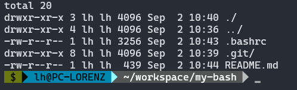

# my-bash

The bash I'm currently using.



## Setup
```bash
cp ~/.bashrc ~/.bashrc.BAK
cp .bashrc ~/.bashrc
source ~/.bashrc
```

If you're using the [Windows Terminal application](https://apps.microsoft.com/store/detail/windows-terminal/9N0DX20HK701?hl=de-de&gl=de&icid=CNavAppsWindowsApps) install the ['CaskaydiaCove Nerd Font'](https://www.nerdfonts.com/font-downloads) on your system and set it as default font in the Windows Terminal.